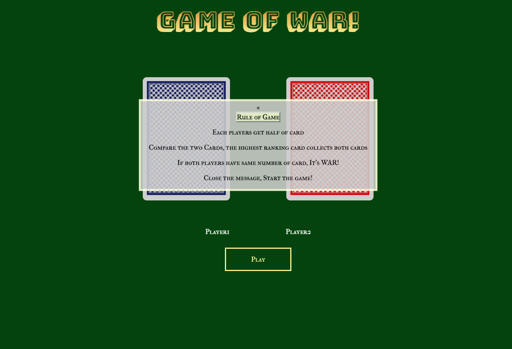
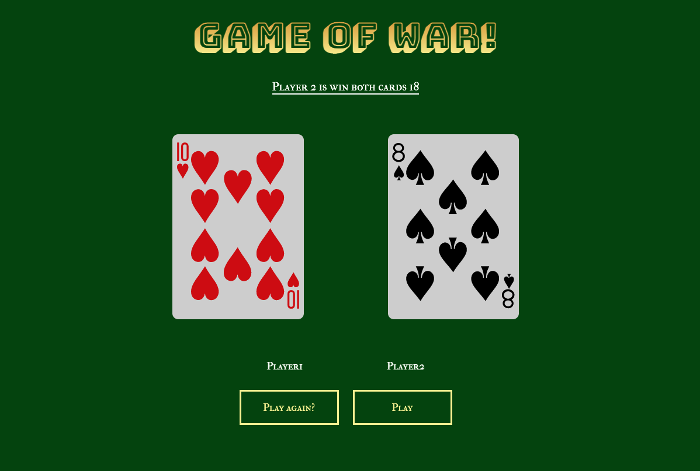

Game of WAR!

The game play with two players. Each player get half of card. The player of the higher card wins the game. If its tie, then it's called WAR!. If you run out of the card then you lose the game. 

Screenshot 

Technologies Used

- Javascript 
- HTML
- CSS

Getting Started

Next Step

