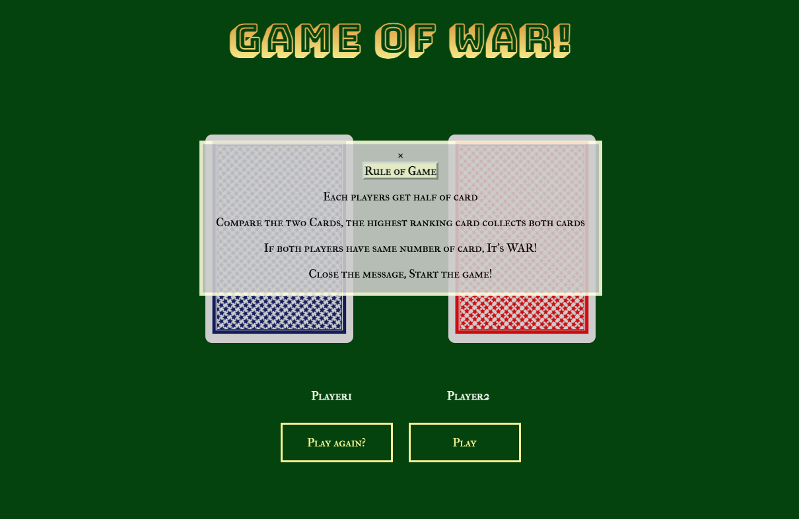
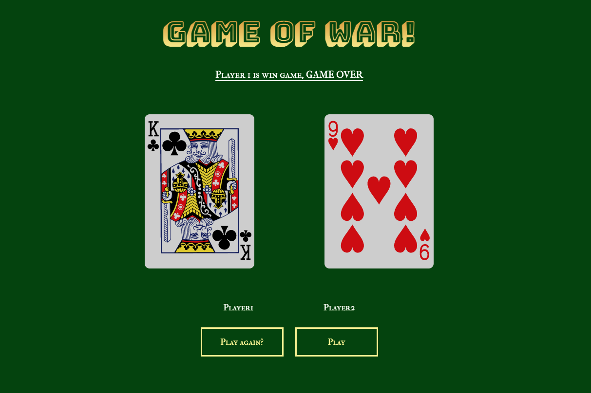

Game of WAR!

The game play with two players. Each player get half of card. The player of the higher card wins the game. If its tie, then it's called WAR!. If you run out of the card then you lose the game. 

Screenshot 

Technologies Used

- Javascript 
- HTML
- CSS

Getting Started https://jinnyyyyy.github.io/Game-of-WAR-/

Instruction Pressed the play button to play. On the top, It will let you know which player is winning. when player reach the certain number, game over

https://jinnyyyyy.github.io/Game-of-WAR-/

Instruction
Pressed the play button to play.
On the top, It will let you know which player is winning.
when player reach the certain number, game over

Next Step
Add the rule of game messages, Seperated button for play and restart.

